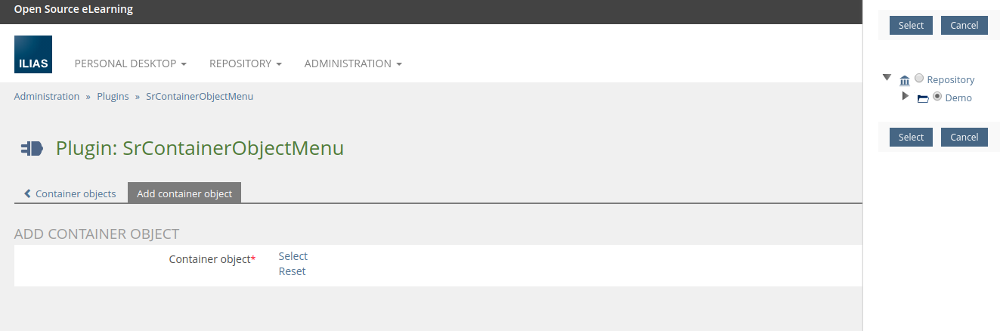
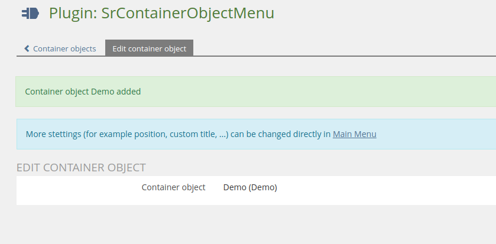
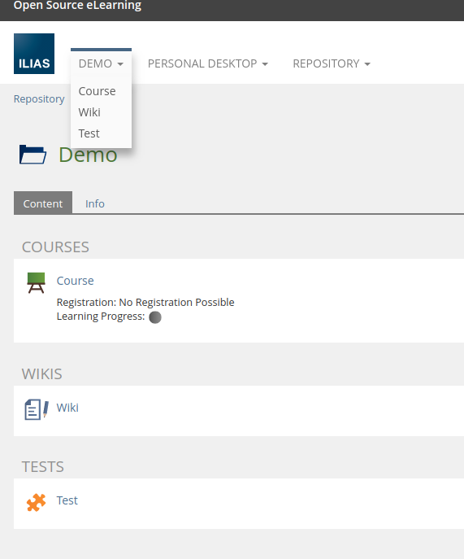

<!-- Autogenerated from composer.json - All changes will be overridden if generated again! -->

# SrContainerObjectMenu ILIAS Plugin


This is an OpenSource project by studer + raimann ag, CH-Burgdorf (https://studer-raimann.ch)

This project is licensed under the GPL-3.0-only license

## Installation

Start at your ILIAS root directory

```bash
mkdir -p Customizing/global/plugins/Services/UIComponent/UserInterfaceHook
cd Customizing/global/plugins/Services/UIComponent/UserInterfaceHook
git clone https://github.com/studer-raimann/SrContainerObjectMenu.git SrContainerObjectMenu
```

Update, activate and config the plugin in the ILIAS Plugin Administration

## Description

Select some repository container objects in the plugin config and the plugin provides it as main menu dropdowns with the objects children

Config:






Menu:



Known issues:
- Currently may some lost items will stay in the main menu administration (You can ignore it because not viewed in the menu or delete it manually)

## Custom event plugins
If you need to adapt some custom SrContainerObjectMenu changes which can not be configured to your needs, SrContainerObjectMenu will trigger some events, you can listen and react to this in an other custom plugin (plugin type is no matter)

First create or extend a `plugin.xml` in your custom plugin (You need to adapt `PLUGIN_ID` with your own plugin id) to tell ILIAS, your plugins wants to listen to SrContainerObjectMenu events (You need also to increase your plugin version for take effect)

```xml
<?php xml version = "1.0" encoding = "UTF-8"?>
<plugin id="PLUGIN_ID">
	<events>
		<event id="Plugins/SrContainerObjectMenu" type="listen" />
	</events>
</plugin>
```

In your plugin class implement or extend the `handleEvent` method

```php
...
require_once __DIR__ . "/../../SrContainerObjectMenu/vendor/autoload.php";
...
class ilXPlugin extends ...
...
	/**
	 * @inheritDoc
	 */
	public function handleEvent(/*string*/ $a_component, /*string*/ $a_event, /*array*/ $a_parameter)/*: void*/ {
		switch ($a_component) {
			case IL_COMP_PLUGIN . "/" . ilSrContainerObjectMenuPlugin::PLUGIN_NAME:
				switch ($a_event) {
					case ilSrContainerObjectMenuPlugin::EVENT_...;
						...
						break;

					default:
						break;
				}
				break;

			default:
				break;
		}
	}
...
```

| Event | Parameters | Purpose |
|-------|------------|---------|
| `ilSrContainerObjectMenuPlugin::EVENT_CHANGE_MENU_ENTRY` | `entry => &AbstractBaseItem`<br>`obj_id => int` | Change menu entry (Please note `entry` is a reference variable, if it should not works) |

## Requirements

* ILIAS 5.4.0 - 6.999
* PHP >=7.0

## Adjustment suggestions

* External users can report suggestions and bugs at https://plugins.studer-raimann.ch/goto.php?target=uihk_srsu_PLCOM
* Adjustment suggestions by pull requests via github

## ILIAS Plugin SLA

We love and live the philosophy of Open Source Software! Most of our developments, which we develop on behalf of customers or on our own account, are publicly available free of charge to all interested parties at https://github.com/studer-raimann.

Do you use one of our plugins professionally? Secure the timely availability of this plugin for the upcoming ILIAS versions via SLA. Please inform yourself under https://studer-raimann.ch/produkte/ilias-plugins/plugin-sla.

Please note that we only guarantee support and release maintenance for institutions that sign a SLA.
